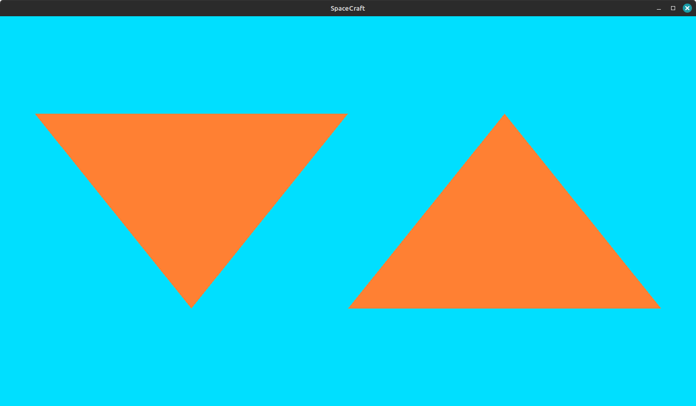

# A simple Minecraft clone, but in space (eventually), done in C++20 and OpenGL



## 1. Installation

### Install GLEW (for OpenGL extensions)
```bash
sudo apt install libglew-dev
# or sudo apt-get install libglew-dev
```

### Install GLFW (for windowing)
```bash
sudo apt install libglfw3-dev
# or sudo apt-get install libglfw3-dev
```

### Install GLM (for math)
```bash
sudo apt install libglm-dev
# or sudo apt-get install libglm-dev
```

### Install OpenGL
```bash
sudo apt install libgl1-mesa-dev
# or sudo apt-get install libgl1-mesa-dev
```

### 2. Build
```bash
mkdir build
cd build
cmake ..
make
```

> *Optional* way to compile the project (without CMake)
> This project can be compiled using the following command (but we'll still be using CMake instead).
> ```bash
> g++ game.cpp ../external/glad/src/glad.c -I../external/glad/include -lglfw -ldl -lGL -std=c++20 -o app
> ```

### 3. Run
```bash
./SpaceCraft
```